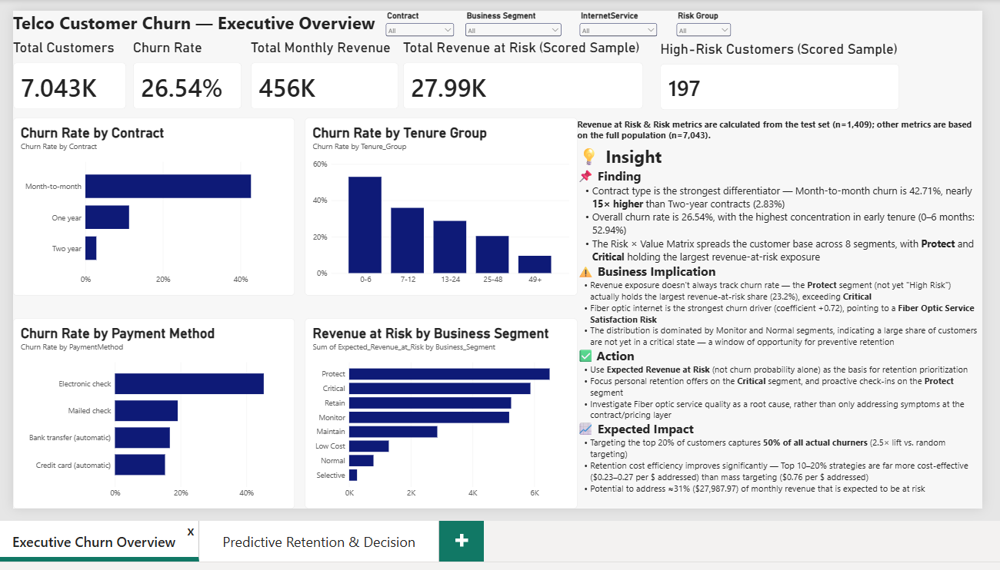
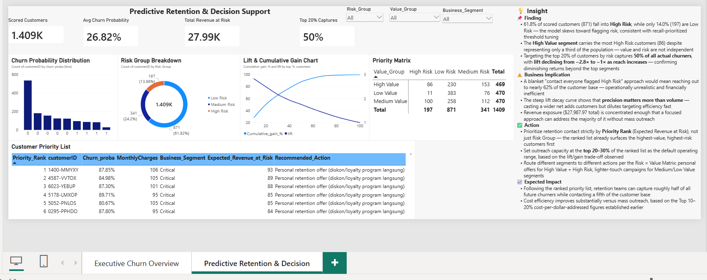

<div align="center">

# 📉 Telco Customer Churn Analytics & Retention Optimization

**End-to-end Data Science project** — from raw data to a calibrated churn prediction model, business-driven risk segmentation, and an interactive Power BI decision dashboard.


</div>

---

## 🧭 Overview

This project goes beyond simply predicting *"who will churn."* It builds a full decision framework:

> **Identify** customers at risk of churn → **Understand** the drivers behind it → **Prioritize** retention action based on churn probability, customer value, and cost efficiency.

Dataset: [IBM Telco Customer Churn](https://www.kaggle.com/datasets/blastchar/telco-customer-churn) — 7,043 customers, 21 features.

---

## 🔑 Key Findings

| Insight | Finding |
|---|---|
| 📊 Overall churn rate | **26.54%** of customers have churned |
| 📄 Strongest churn driver | Month-to-month contracts churn at **42.71%** vs. **2.83%** for two-year contracts |
| ⏳ Early-life risk | Customers in their first 6 months churn at **52.94%** |
| 🌐 Model driver #1 | **Fiber optic internet** is the strongest predictor of churn (logistic regression coefficient +0.72) |
| 💰 Revenue exposure | **≈31% (~$27,988/month)** of scored revenue is expected to be at risk |
| 🎯 Targeting efficiency | Targeting the **top 20%** highest-priority customers captures **50% of all churners**, with **2.5× lift** over random targeting |
| 💸 Cost efficiency | Model-driven targeting is up to **3× more cost-efficient** than mass outreach for equivalent risk coverage |

> ⚠️ All financial figures are **scenario-based projections** using an illustrative retention cost assumption — not validated real-world savings. Details in [`docs/06_business_recommendations.md`](docs/06_business_recommendations.md).

---

## 📊 Dashboard Preview

### Sheet 1 — Executive Overview


### Sheet 2 — Predictive Retention & Decision Support


📁 Full interactive file: [`dashboard/telco_churn_retention_dashboard.pbix`](dashboard/telco_churn_retention_dashboard.pbix)

---

## 🛠️ Tech Stack

| Layer | Tools |
|---|---|
| Data Processing | Python, Pandas, NumPy |
| Machine Learning | Scikit-learn (Logistic Regression, Random Forest, CalibratedClassifierCV) |
| Evaluation | ROC-AUC, PR-AUC, Brier Score, Lift & Cumulative Gain |
| Visualization | Power BI, DAX |
| Documentation | Markdown |

---

## 🧩 Project Pipeline

```
Raw Data
   │
   ▼
Data Cleaning & Feature Engineering
   │
   ▼
EDA (churn by contract, tenure, payment method)
   │
   ▼
Model Training (Logistic Regression vs Random Forest)
   │
   ▼
Threshold Tuning → Probability Calibration
   │
   ▼
Customer Value Proxy → Risk × Value Segmentation
   │
   ▼
Revenue at Risk → Retention Priority Ranking
   │
   ▼
Lift & Cumulative Gain Analysis
   │
   ▼
Churn Driver Analysis → Retention Strategy
   │
   ▼
Quantitative Trade-off Simulation
   │
   ▼
Power BI Dashboard
```

---

## 📁 Repository Structure

```
04_Telco_Customer_Churn/
│
├── README.md                          ← you are here
│
├── dashboard/
│   └── telco_churn_retention_dashboard.pbix
│
├── screenshots/
│   ├── 01_executive_overview.png
│   └── 02_redictive_retention_and_Decision.png
│
└── docs/
    ├── 01_workflow_pipeline.md        ← project plan & phased roadmap
    ├── 02_python_scripts.md           ← full, runnable code (all stages)
    ├── 03_fase_0-3.md                 ← results & findings, Phase 0–3
    ├── 04_methodology_notes.md        ← technical decisions & rationale
    ├── 05_data_dictionary.md          ← definition of every column/field
    └── 06_business_recommendations.md ← non-technical business summary
```

---

## 📖 Documentation Guide

| Read this if you want to... | Go to |
|---|---|
| Understand the full roadmap & phased approach | [`01_workflow_pipeline.md`](docs/01_workflow_pipeline.md) |
| Reproduce every step from raw CSV to final scoring | [`02_python_scripts.md`](docs/02_python_scripts.md) |
| See detailed results, numbers, and findings per phase | [`03_fase_0-3.md`](docs/03_fase_0-3.md) |
| Understand *why* each modeling decision was made | [`04_methodology_notes.md`](docs/04_methodology_notes.md) |
| Look up what any column/feature means | [`05_data_dictionary.md`](docs/05_data_dictionary.md) |
| Get a non-technical summary for stakeholders | [`06_business_recommendations.md`](docs/06_business_recommendations.md) |

---

## ⚠️ Key Limitations

This dataset contains **no historical treatment/outcome data** — meaning we don't know whether past retention efforts (discounts, personal outreach, etc.) actually reduced churn. As a result:

- All prioritization is **risk-based**, not causally validated
- All cost/savings figures are **scenario simulations** with explicit illustrative assumptions
- Small-population segments (e.g. n < 15) should not be treated as statistically robust patterns

Full discussion in [`04_methodology_notes.md`](docs/04_methodology_notes.md) and [`06_business_recommendations.md`](docs/06_business_recommendations.md).

---

## 👤 Author

**Ahmad Farid**

- 📧 Email: [ahmad.fariden@gmail.com](mailto:ahmad.fariden@gmail.com)
- 💼 LinkedIn: [linkedin.com/in/ahmadfariden](https://linkedin.com/in/ahmadfariden)
- 💻 GitHub: [github.com/ahmadfariden](https://github.com/ahmadfariden)

---

<div align="center">

*If you found this project useful or interesting, consider giving it a ⭐*

</div>
